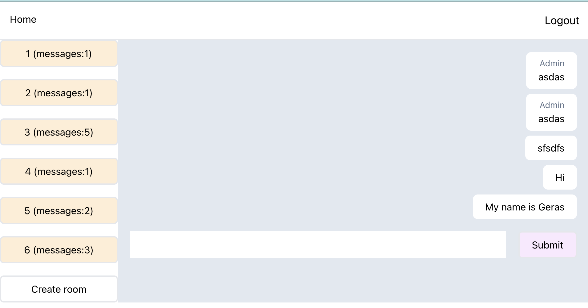

# Nest - Тестовое задание (СтилЛедиМакс, ЧП / slmax)

## Условие:

Разработать систему обмена сообщениями

Примерный интерфейс: https://disk.yandex.ru/d/Jki3ifm3oKAHwg

Необходима регистрация, авторизация (логин пароль).
Отправлять сообщения можно формой.
Необходим поиск по сообщениям в чате.
Все пользователи видят все чаты, любой пользователь может создать чат.

Фронтенд - делайте как сможете, можете использовать готовый, оценивать будем только backend реализацию.

Отправку и получение сообщений - сделать через Socket.
Обязательно учесть возможность передавать через чат файлы.

Стэк: на ваше усмотрение
Адаптивность: Не обязательна

Создать readme.md файл с описанием запуска проекта


# slmax-nest-testovoe-zadanie



### Run server

```
cd ./server
npm i
npm start
```

- Apollo sandbox available by [URL](http://localhost:4000/graphql)

### Run client

```
cd ./client
npm i
npm start
```
